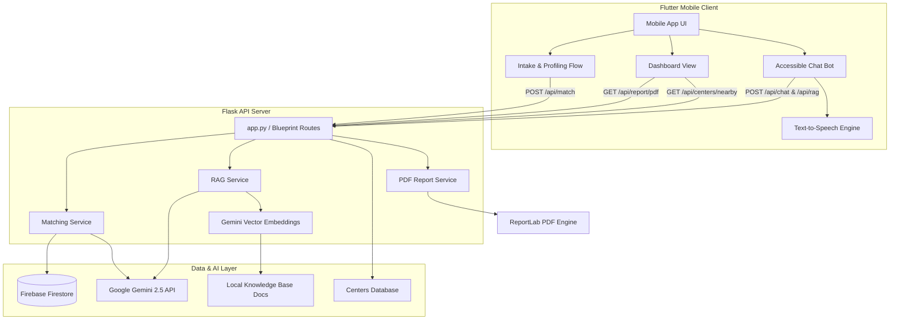

# Neuro Guard

> **An Adaptive Assistant & Smart Advocacy Hub for Neurodivergent Individuals**

Neuro Guard is a cross-platform mobile application designed to empower neurodivergent individuals (specifically focusing on Autism Spectrum and sensory sensitivities) and their support networks. It simplifies access to personalized government schemes, tailored workplace/academic accommodations, therapy locator services, and contextual intelligence using Retrieval-Augmented Generation (RAG) and the Google Gemini 2.5 API.

---

## Features

*   **Dynamic Intake & Profiling**  
    Tailored onboarding experience capture key metrics: sensory sensitivity profiles (High/Moderate/None), communication methods (Verbal, Non-verbal/AAC), employment/student status, geographic location, and income ranges.
*   **Smart Scheme & Resource Matcher**  
    Instantly computes eligibility for central initiatives (e.g., *Niramaya Health Insurance Scheme*) and state-level benefits (e.g., *Kerala Swavalamban & Keerthi Assistance*). Generates personalized resource recommendations and adaptive strategies.
*   **Custom Action Plans**  
    Generates dynamic step-by-step checklists, such as guidelines for applying for Unique Disability ID (UDID) cards, requesting academic accommodations, or workplace adjustments based on user profiles.
*   **AI Diagnostics & Explanations**  
    Utilizes Google Gemini to generate custom natural-language explanations explaining *why* certain schemes match a profile, alongside personalized risk assessment and profile-similarity insights.
*   **RAG-Enabled Knowledge Base**  
    An intelligent Retrieval-Augmented Generation query engine that answers questions using embedded knowledge base documents, powered by Google's `text-embedding-004` and `gemini-2.5-flash`.
*   **Therapy Center Locator**  
    Quickly matches and ranks nearby neurological/therapy centers by evaluating regional proximity (pincode and state prefixes).
*   **Exportable PDF Reports**  
    Allows users to download a professional, comprehensive PDF report summarizing their profile details, matched benefits, action checklist, and resources.

---

## System Architecture



---

## Project Structure

```text
neuro_guard/
├── backend/                       # Python Flask Backend
│   ├── config/                    # Configuration modules (Firebase & Gemini)
│   │   ├── firebase_config.py
│   │   └── gemini_config.py
│   ├── credentials/               # Storage for secure credential keys
│   │   └── firebase-key.json      # Firebase service account key
│   ├── data/                      # Data assets & Local databases
│   │   ├── knowledge_base/        # Source documents for RAG context
│   │   ├── centers.json           # Therapy centers dataset
│   │   └── kb_vector_cache.json   # Cached vector embeddings
│   ├── routes/                    # API Endpoints (Health, Match, Chat, RAG, etc.)
│   ├── services/                  # Business & Core AI Logic
│   │   ├── matching_service.py
│   │   ├── rag_service.py
│   │   ├── pdf_report_service.py
│   │   └── risk_prediction_service.py
│   ├── app.py                     # Main Flask entrypoint
│   └── requirements.txt           # Python backend dependencies
│
├── frontend/                      # Dart Flutter Frontend
│   ├── assets/images/             # UI Image assets
│   ├── lib/
│   │   ├── models/                # App data models
│   │   ├── screens/               # Mobile UI screens (Dashboard, Intake, etc.)
│   │   ├── services/              # Client services (TTS engine integration)
│   │   ├── config.dart            # API Endpoint configurations
│   │   ├── theme.dart             # Styling and global Material theme
│   │   └── main.dart              # Flutter App entrypoint
│   └── pubspec.yaml               # Flutter package configuration
│
├── backend_test.py                # Backend module verification script
└── logo_resizer.py                # App icons generator utility script
```

---

## Tech Stack

### Frontend (Client-side)
*   **Framework**: [Flutter](https://flutter.dev/) (SDK version `^3.12.2`)
*   **Language**: [Dart](https://dart.dev/)
*   **Key Packages**:
    *   `http` (API integration)
    *   `flutter_tts` (Text-to-Speech accessibility)
    *   `google_fonts` (Premium Typography - Inter, Outfit, etc.)
    *   `url_launcher` (External resource redirects)

### Backend (Server-side)
*   **Framework**: [Flask](https://flask.palletsprojects.com/)
*   **Language**: Python 3
*   **Database**: [Google Firebase Firestore](https://firebase.google.com/)
*   **AI Engine**: [Google Generative AI SDK](https://ai.google.dev/) (`gemini-2.5-flash` & `text-embedding-004`)
*   **Key Libraries**:
    *   `ReportLab` (Dynamic PDF generator)
    *   `Pillow` (Image processing)
    *   `python-dotenv` (Environment variable configuration)

---

## Installation & Setup

### Prerequisites
*   [Flutter SDK](https://docs.flutter.dev/get-started/install) installed locally.
*   [Python 3.x](https://www.python.org/downloads/) installed.
*   A Google Gemini API key (obtainable from [Google AI Studio](https://aistudio.google.com/)).
*   A Firebase project with Firestore database initialized (with the Private Key downloaded in JSON format).

---

### 1. Backend Setup

1.  **Navigate into the backend directory:**
    ```bash
    cd backend
    ```

2.  **Create and activate a virtual environment:**
    ```bash
    python -m venv venv
    
    # On Windows:
    .\venv\Scripts\activate
    # On macOS/Linux:
    source venv/bin/activate
    ```

3.  **Install dependencies:**
    ```bash
    pip install -r requirements.txt
    ```

4.  **Configure environment variables:**
    Create a file named `.env` in the `backend` directory and add your Google Gemini API key:
    ```env
    GEMINI_API_KEY=your_gemini_api_key_here
    ```

5.  **Set up Firebase Credentials:**
    *   Download your Firebase service account JSON key.
    *   Save the file at `backend/credentials/firebase-key.json`.

6.  **Run the Flask application:**
    ```bash
    python app.py
    ```
    The backend server will start on `http://localhost:5000`.

---

### 2. Frontend Setup

1.  **Navigate to the frontend directory:**
    ```bash
    cd ../frontend
    ```

2.  **Install Dart dependencies:**
    ```bash
    flutter pub get
    ```

3.  **Update API Endpoint Config (Optional):**
    If deploying to an Android Emulator or local network, configuration settings are mapped dynamically inside `lib/config.dart`. Ensure the IP matches your setup (defaults to `10.0.2.2` for Android emulator loopback).

4.  **Run the mobile app:**
    ```bash
    flutter run
    ```

---

## Testing and Utilities

*   **Backend Diagnostics**: You can verify that all dependencies and routes are correctly configured by executing the test script in the project root:
    ```bash
    python backend_test.py
    ```


---
## Demo video 


https://github.com/user-attachments/assets/b4c4f7d6-0c61-4a9d-b0b3-d295a5ace5bd


